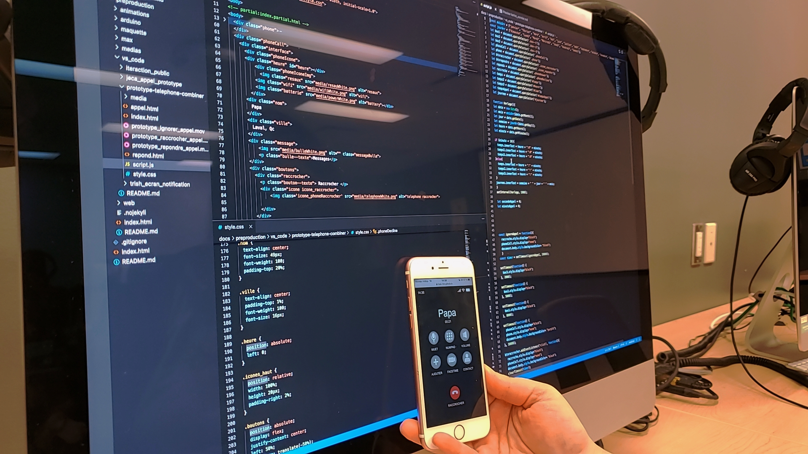
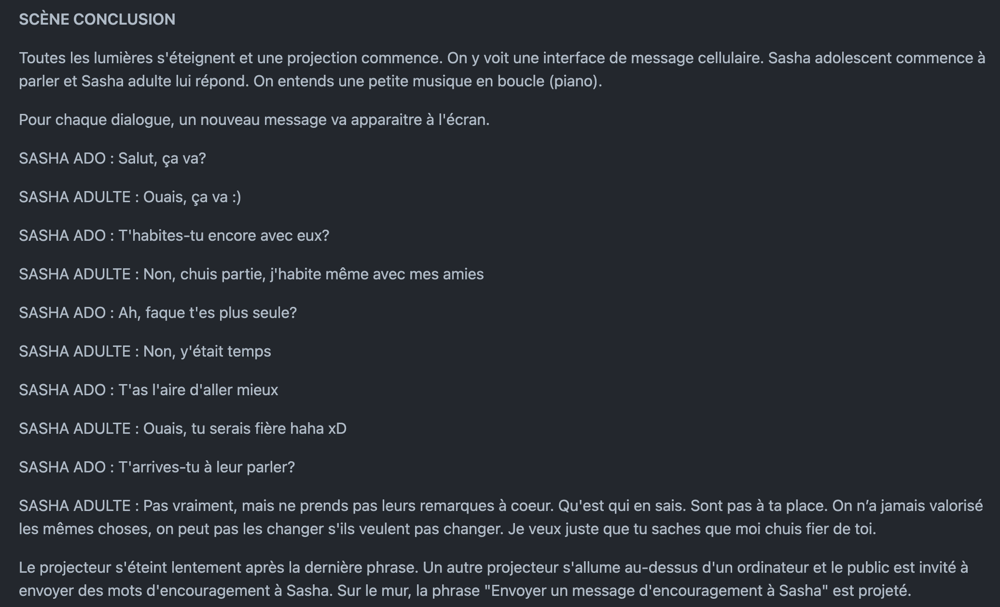
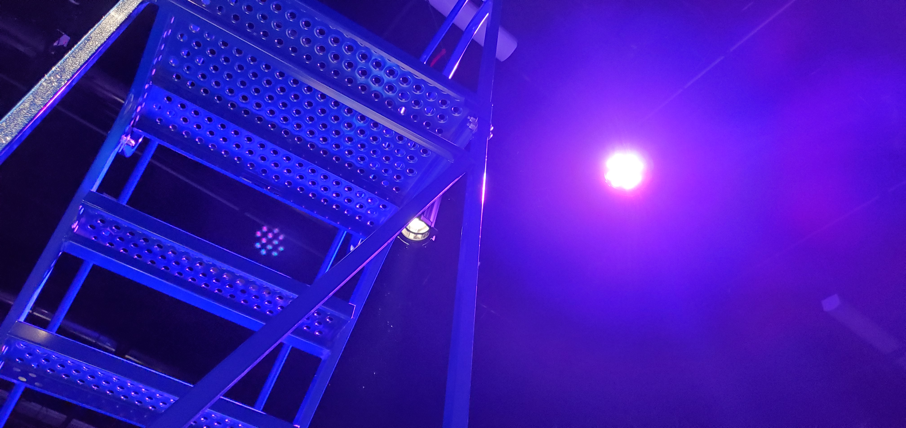
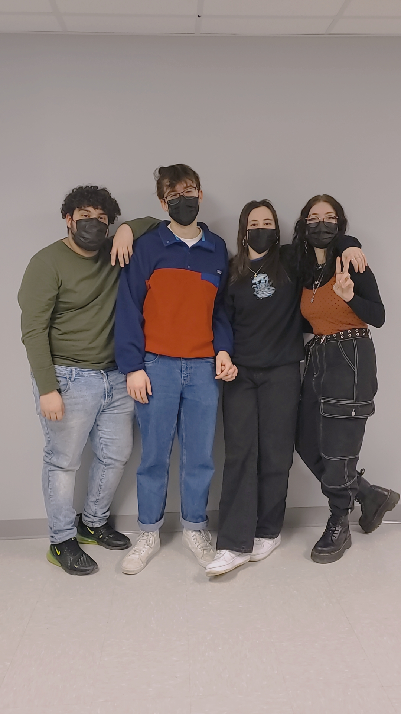
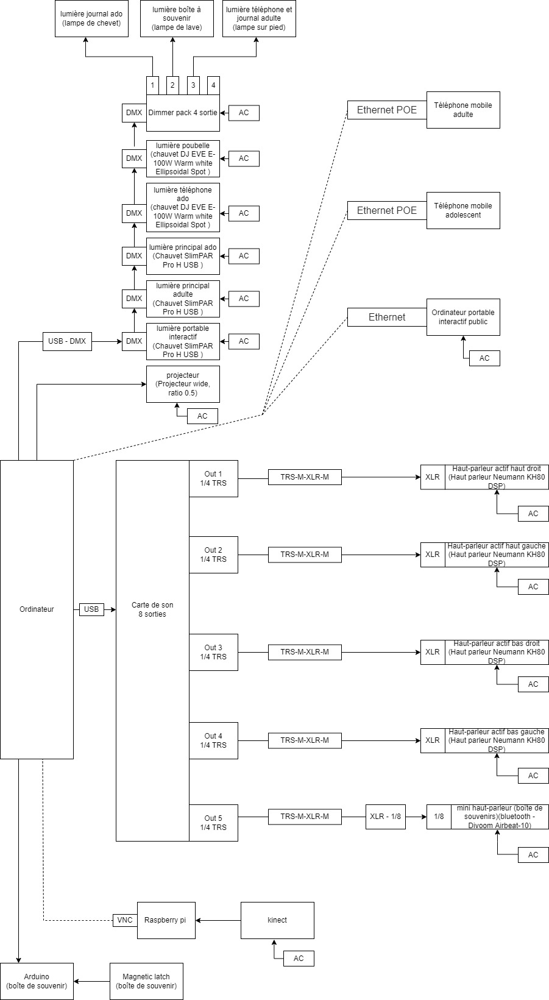

# Chère Sacha

## Les créatrices
Trish Nguyen, Angelina De Silvia Jeca, Karine Cormier et Sabrina Kayani

## La façon dont le thème du temps est exploité dans la création
Le public croit que les deux personnages sont différent, mais c'est Sacha adolescente et Sacha adulte. Le décalage entre les deux personnages s'explique grâce au temps, donc le temps est très explicitement exploité dans l'oeuvre. Elles veulent aussi représenter le temps en utilisant une horloge, un sablier et un chronomètre.

## L'ambiance
Ça sera très lourd, mais aussi joyeux.

## L'installation en cours dans les studios (photos à l'appui)
Création du CSS et du JavaScript

Création du scénario

Installation du projecteur

Installation des lumières

Enregistrement des 4 doubleurs

## Le schéma de l'installation prévue (insérer le schéma de plantation, avec la source)

https://github.com/task-tim/Chere-Sasha/blob/main/docs/preproduction/medias/plantation_01.jpg

https://github.com/task-tim/Chere-Sasha/blob/main/docs/preproduction/medias/plantation_02.jpg
## Ce qui sera attendu de vous, en tant qu'interacteur.trice, lorsque vous ferez l'expérience de l'installation
Le projet est en grande partie contemplatif, donc le public doit seulement vivre l'oeuvre. À la fin de l'oeuvre, l'utilisateur devra envoyé un message à Sasha.

## 3 cours du programme qui vous semblent incontournables pour avoir les compétences pour créer ce projet (voir la grille de cours du programme)
Animation 2D, conception sonore et espace intéractif.
