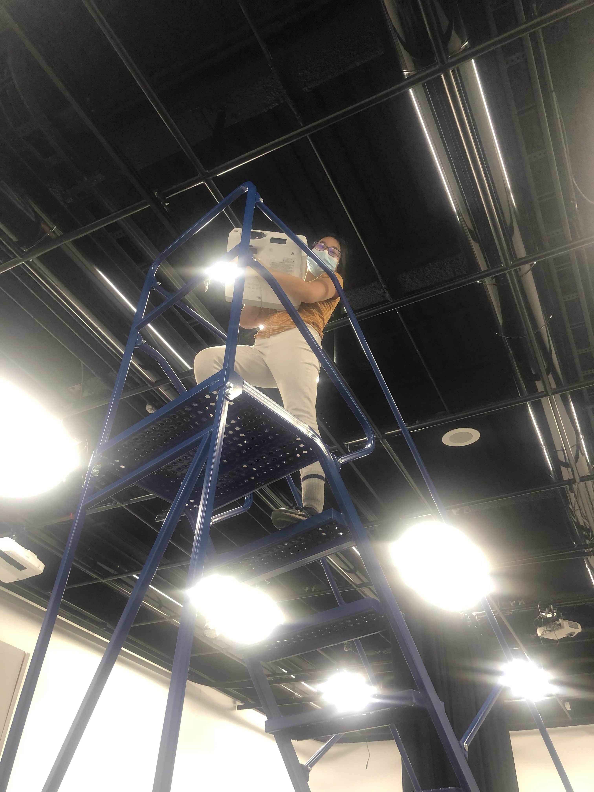
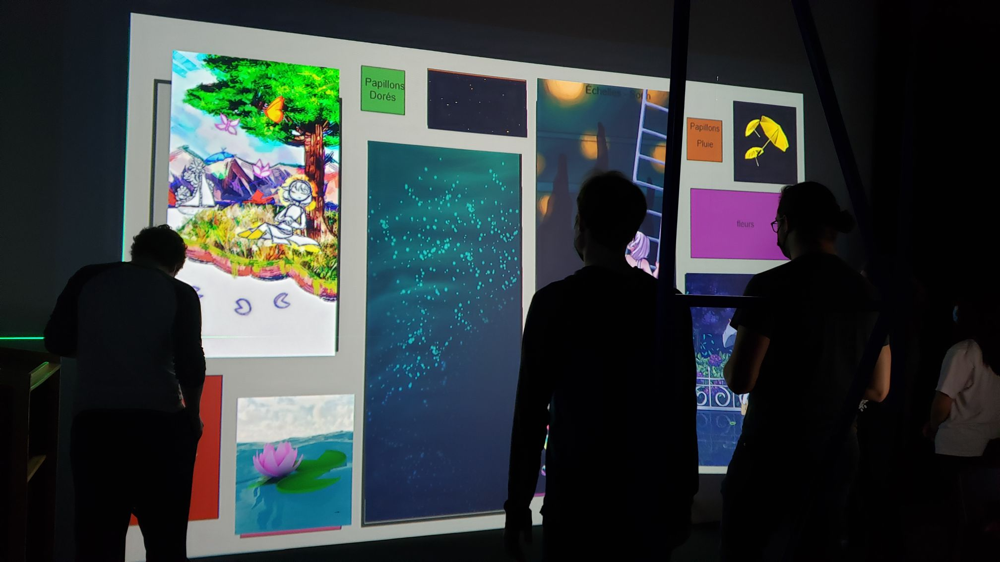
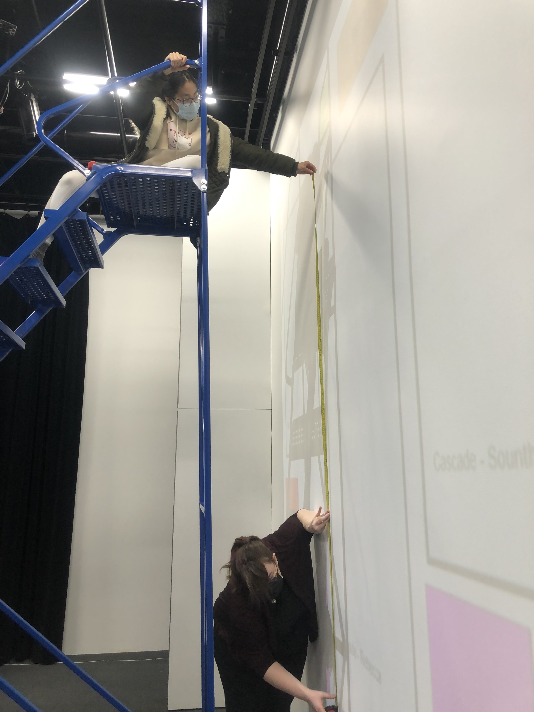
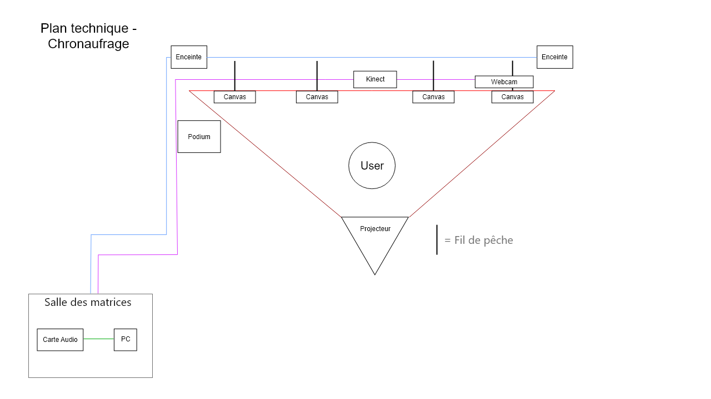

## Chronaufrage

## crée par Maloney Khim, Sountida Kong, Olivier Lalonde, Rebecca Pilote et Émilie Fontaine

## la façon dont le thème du temps est exploité dans la création
Les peintures montrent un personnage qui passe tout son temps à chercher du temps. À la fin, elle a ironiquement perdu plus de temps à chercher ceci. Cela est une allégorie pour la société qui nous met de la pression de toujours être productif et ne jamais avoir de pause.

[Source](https://github.com/Blobduckies/Chronaufrage)

## l'ambiance
L'ambiance change en fonction de la position de l'utilisateur et des gestes qu'on fait devant les peintures. Ça commence avec un ambiance avec peu d'espoir et fini avec une qui est plus relax et paisible.

## l'installation en cours dans les studios

L'installation d'un projecteur

Les emplacements des peintures

Prise de mesure

[Source](https://github.com/Blobduckies/Chronaufrage)

## le schéma de l'installation prévue

[Source](https://github.com/Blobduckies/Chronaufrage)

## ce qui sera attendu de moi, en tant qu'interacteur, lorsque vous ferez l'expérience de l'installation

L'interacteur aura pour but de se déplacer devant les peintures et faire des gestes pour changer ce que la peinture montre

## 3 cours du programme qui vous semblent incontournables pour avoir les compétences pour créer ce projet

Conception Sonore - Dans le but de faire une trame sonore qui plonge immerge l'utilisateur

Animation 2D - Pour avoir des animations qui sont plaisant à observer

Espace Interactif - Pour avoir des capteurs qui vont changer les peintures selon la position de l'utilisateur

[Source](https://www.cmontmorency.qc.ca/programmes/nos-programmes-detudes/techniques/techniques-dintegration-multimedia/grille-de-cours/)
