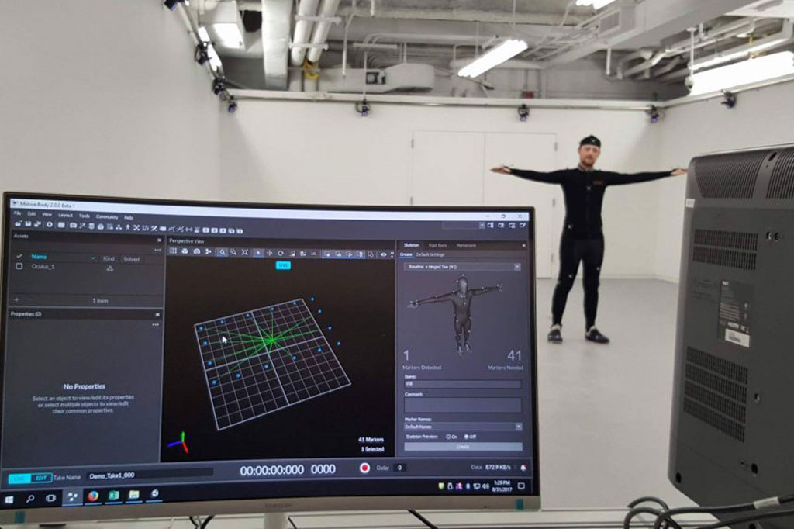
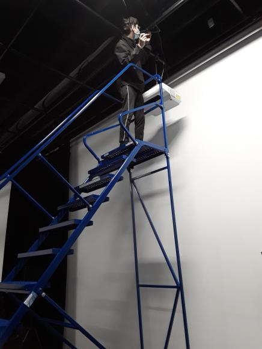
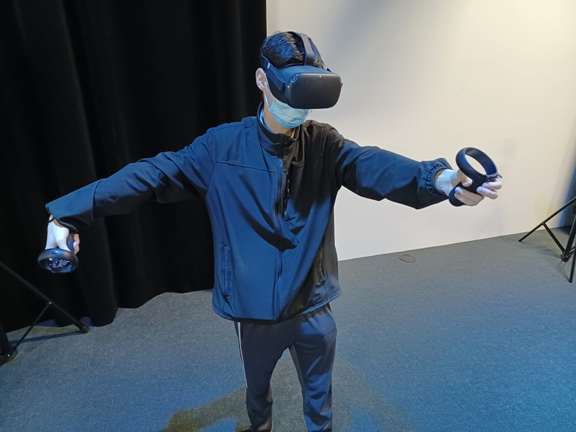
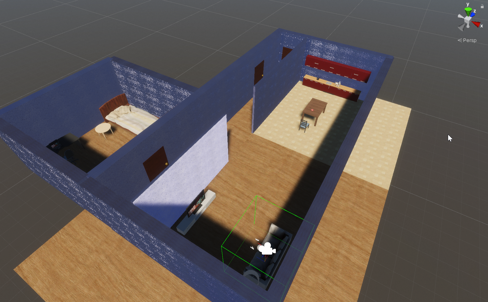

## Distorsion Collective

## crée par William Dubois et Ghislain Lacombe

## la façon dont le thème du temps est exploité dans la création
L'expérience est de la perspective d'un élève à l'école durant un cour en ligne. L'isolement déteriore la santé mentale de celui-ci et il semble être pris dans un cycle infini.

[Source](https://github.com/Freakout-Programs/Distorsion-collective)

## l'ambiance
L'ambiance change en fonction de la progression de l'expérience. Le plus loin on est, le plus chaotique et désorganisé l'entourage est.

## l'installation en cours dans les studios (photos à l'appui)

Motion Capture

Installation du projecteur

Travaux VR

L'environnement Unity

[Source](https://github.com/Freakout-Programs/Distorsion-collective)

## le schéma de l'installation prévue

[Source](https://github.com/Freakout-Programs/Distorsion-collective)

## ce qui sera attendu de vous, en tant qu'interacteur.trice, lorsque vous ferez l'expérience de l'installation
L'interacteur aura pour but d'observer l'environnement changer lors de l'expérience et comprendre les difficultés de l'apprentissage à distance.

## 3 cours du programme qui vous semblent incontournables pour avoir les compétences pour créer ce projet

Conception sonore - Dans le but de faire une trame sonore qui plonge immerge l'utilisateur

Réalité Virtuelle - Pour faire l'utilisation du casque VR

Modélisation 3D - Pour faire des environnements 3D convincant

[Source](https://www.cmontmorency.qc.ca/programmes/nos-programmes-detudes/techniques/techniques-dintegration-multimedia/grille-de-cours/)

