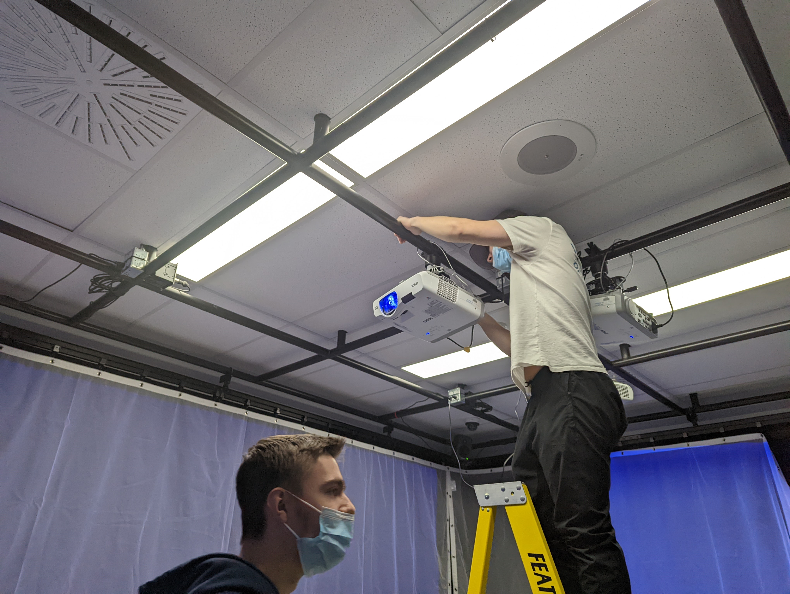
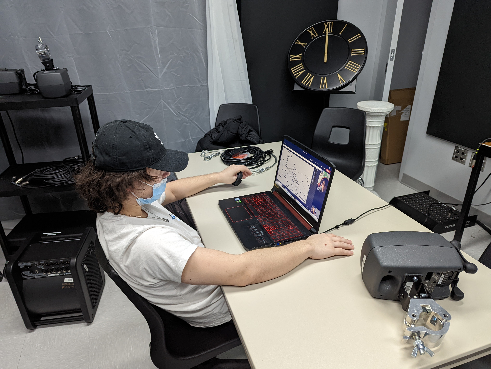
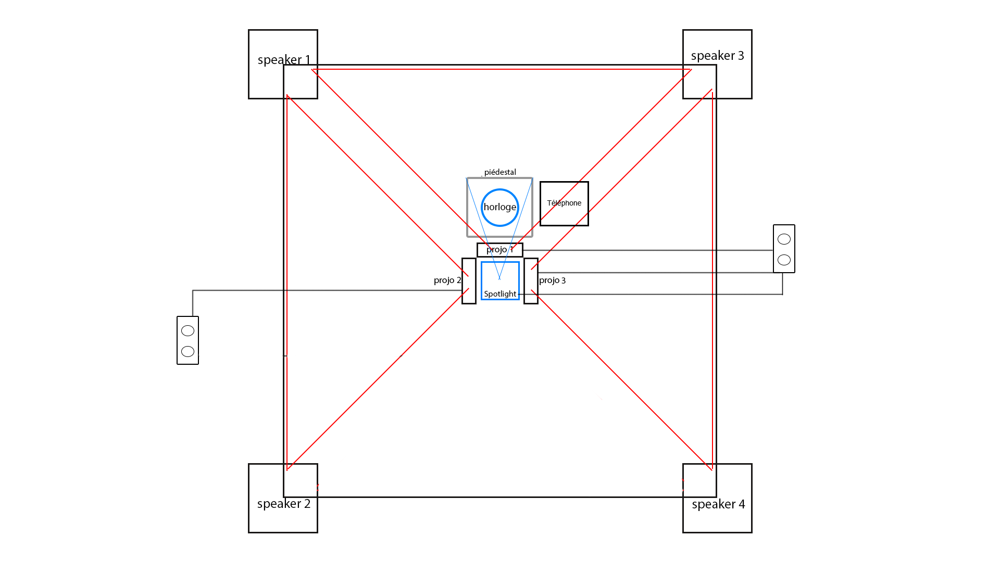

# L'horloge de l'apocalypse
crée par Maxime Sabourin, Louis-Philippe Gravel, Alexis Lacasse, Tristan Girard-Montpetit et Maxime De Falco

## La façon dont le thème du temps est exploité dans la création
L'impact collectif sur les événements socio-politiques et environnementaux qui se produisent tout au long du temps de l'humanité. Ce sujet est abordé à travers le concept de l'horloge de l'apocalypse. Selon ce concept, La fin du monde est à 24h00.

[Source](https://github.com/MALT5/L-horloge-de-l-apocalypse)

## L'ambiance
L'ambiance change en fonction de l'heure déterminé.
Dans le but de mettre dans différent état l'utilisateur, l'ambiance passe de très calme à une ambiance d'apocalypse si l'on suit le fuseau horaire.

## L'installation en cours dans les studios (photos à l'appui)

Projecteur installé

Début d'installation avec l'horloge et les enceintes

[Source](https://github.com/MALT5/L-horloge-de-l-apocalypse)

## Le schéma de l'installation prévue (insérer le schéma de plantation, avec la source)

[Source](https://github.com/MALT5/L-horloge-de-l-apocalypse)

## Ce qui sera attendu en tant qu'interacteur.trice, lors de l'expérience de l'installation
L'interacteur aura pour but de modifier l'heure et l'ambiance grâce à une horloge.
Il doit faire quelque chose avant minuit car c'est à ce moment-là que se produira la fin du monde.

## 3 cours du programme qui me semblent incontournables pour avoir les compétences pour créer ce projet (voir la grille de cours du programme)
Conception sonore / Dans le but de faire une trame sonore réaliste et qui plonge réellement l'utilisateur dans l'ambiance

Montage vidéo / Afin de créer et de représenter des images réalistes pour montrer les différents moments et les différentes ambiances

Animation 3d / Pour la raison que certains éléments ne peuvent pas être capturer en vidéo, il faudra donc les recréer

[Source](https://www.cmontmorency.qc.ca/programmes/nos-programmes-detudes/techniques/techniques-dintegration-multimedia/grille-de-cours/)
